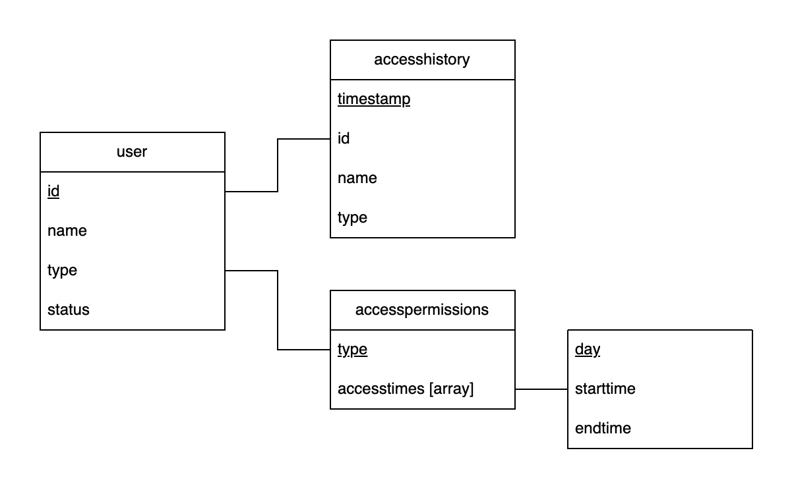

# CMPSC 487W Project 1 – Engineering Requirements

**Jacq Lee (jxl6891)**

## Programing language

This project was written in Vite + React.

## High level requirments

Requirements as defined by the problem description:

- Every entry into the SUB Lab **MUST** be validated via the user’s ID by swiping it on a card reader
  - Every card swipe / entry **MUST** be stored on a database with the user’s ID and the timestamp of the event
  - All records of SUN Lab access **MUST** be stored for 5 years
- An authorized account **MUST** be able to perform the following actions:
  - Browse the access history via a GUI
    - Filter the access history by user ID
    - Filter the access history by date range
    - Filter the access history by time range
- The system **MUST** be able to accomodate multiple user types
- The system **MUST** be able to accomodate an activate/deactivate ID function via an authorized account

Some other requirements:

- An authorized account **SHOULD** be able to perform the following actions:
  - Browse the user list via a GUI
    - Filter the user list by user ID
  - Browse the access permissions for each type via a GUI
    - Edit the access permissions for each type

## Database documentation

The database chosen for this project is Google Firebase, with the following collections (tables) as shown in the diagram.

Each primary key, underlined in the diagram, acts as the unique document (row) name in the collection.

The `user` collection represents any individual attempting to enter the SUN Lab, where

- `id` is the unique ID number associated with the user (the Penn State student ID in the case of students, for example)
- `name` is the name of the user
- `type` is the access type of the user, such as `student` or `admin`
- `status` is whether the current user’s access is `active` or `inactive`

The `accesshistory` collection collects all successful entries into the SUN Lab, where

- `timestamp` is the time when the entry occured
- `id` is the ID of the user entering the SUN Lab
- `name` is the name of the user entering the SUN Lab
- `type` is the access type of the user entering the SUN Lab

The `accesspermissions` collection defines the access permissions associated with each access type, where

- `type` is the access type for which permissions are being defined
- `accesstimes` is an array of objects with structure `{day, starttime, endtime}` such that
  - `day` represents a day of the week
  - `starttime` and `endtime` represent the range during which users of this `type` can access the SUN Lab for this particular `day`
